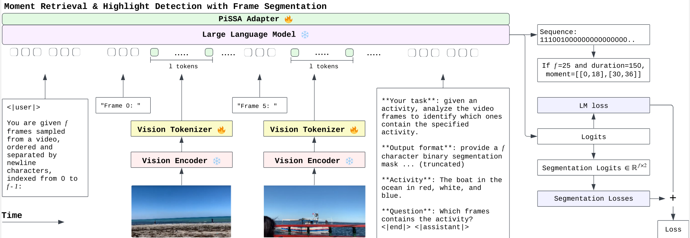
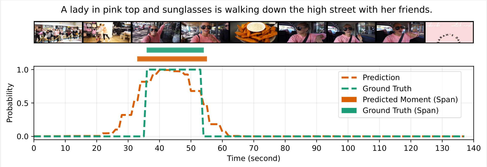

# Moment and Highlight Detection via MLLM Frame Segmentation

**Preprint** : [arxiv.org/abs/2512.12246](https://arxiv.org/abs/2512.12246)

## Overview

This method uses frame segmentation with MLLMs to try and solve two video understanding tasks:

### Moment Retrieval
**Input:** Video + natural language query  
**Output:** Temporal boundaries in seconds

> **User:** "Find where the lady in pink walks down the streets with her friends"  
> **Model:** `[[0,10], [30,40]]`  

*Evaluated using IoU-based metrics (R@0.5, R@0.7, mAP)*

### Highlight Detection
**Input:** Video + activity description  
**Output:** Likeliness (saliency) scores per clip

> **User:** "What's the best clip showing 'girl getting her stuff in new room'?"  
> **Model:**  
> - `[0, 10]` → score: 0.8 (Pick this one!)  
> - `[10, 25]` → score: 0.5  
> - `[25, 35]` → score: 0.1  

*Evaluated using hit rate*


## Method

```
Video → F frames + query → LLM → F chars (0/1 sequence) → Segmentation + LM loss
```

**Key idea:** Output binary sequence where `1` = relevant frame, `0` = irrelevant



The method will pushed further. We aim to submit an improved paper to IJCAI 2026.

### Moment Retrieval with the Method

**Input:** Video + natural language query  
**Output:** Temporal boundaries in seconds

> **User:** "Find where the lady in pink walks down the streets with her friends! By the way, there are 25 frames"  
> **Model:** `1101100000000000000000000` → `[[0,12],[18,30]]`
>
> *25 frames spanning 150s video. Binary mask directly converts to moments. 1 char = 6 second window.*

### Highlight Detection with the Method

**Input:** Video + activity description  
**Output:** Saliency scores per clip

> **User:** "What's the best clip showing 'girl getting her stuff in new room'? By the way, there are 25 frames."  
> **Model scores:** `[0.8, 0.5, 0.1, ...]`
> 
> **Model:**  
> `[0, 10]` → 0.8 (Pick this one!!)  
> `[10, 25]` → 0.5  
> `[25, 35]` → 0.1
>
> *Score for each position is just* `softmax([logit_of_0, logit_of_1])[1]`

### Sample Prediction vs Ground-truth




## Resources

| Type | Description | Link |
|------|-------------|------|
| Base Model | BLIP-3 | [Salesforce/xgen-mm-phi3-mini-instruct-interleave-r-v1.5](https://huggingface.co/Salesforce/xgen-mm-phi3-mini-instruct-interleave-r-v1.5) |
| Original Dataset | QVHighlights | [moment_detr](https://github.com/jayleicn/moment_detr) |
| Preprocessed Dataset | 25-frame train and val splits | [jwnt4/qvhighlights-25frames](https://huggingface.co/datasets/jwnt4/qvhighlights-25frames) |
| Preprocessed Dataset | 25-frame test split | [jwnt4/qvhighlights-25frames-test](https://huggingface.co/datasets/jwnt4/qvhighlights-25frames-test) |
| Model Checkpoint | Merged model (ready-to-use) | [jwnt4/xgenmm-mr-v1-merged](https://huggingface.co/jwnt4/xgenmm-mr-v1-merged) |
| Model Weights | Vision tokenizer only | [jwnt4/xgenmm-mr-v1-vision_tokenizer](https://huggingface.co/jwnt4/xgenmm-mr-v1-vision_tokenizer) |
| Model Weights | LM adapter (PiSSA+rsLoRA) | [jwnt4/xgenmm-mr-v1-lang_model-pissa-r16a16-rslora](https://huggingface.co/jwnt4/xgenmm-mr-v1-lang_model-pissa-r16a16-rslora) |


## Performance

### Validation Set

**Moment Retrieval**

| Segment Length | R1@0.5 | R1@0.7 | mAP | mAP@0.5 | mAP@0.75 |
|----------------|--------|--------|-----|---------|----------|
| Full  | 62.32 | 38.19 | 36.17 | 56.80 | 37.22 |
| Long | - | - | 52.64 | - | - |
| Middle | - | - | 32.64 | - | - |
| Short | - | - | 1.11 | - | - |

**Highlight Detection**

| Quality Level | mAP | HIT@1 |
|---------------|-----|-------|
| VeryGood | 34.64 | 58.52 |
| Good | 59.20 | 72.13 |
| Fair | 71.78 | 74.90 |

### Test Set

**Moment Retrieval**

| Segment Length | R1@0.5 | R1@0.7 | mAP | mAP@0.5 | mAP@0.75 |
|----------------|--------|--------|-----|---------|----------|
| Full (used in paper) | 60.77 | 37.42 | 35.28 | 56.26 | 35.80 |
| Long | - | - | 53.79 | - | - |
| Middle | - | - | 29.77 | - | - |
| Short | - | - | 1.29 | - | - |

**Highlight Detection**

| Quality Level | mAP | HIT@1 |
|---------------|-----|-------|
| VeryGood (used in paper) | 34.48 | 56.74 |
| Good | 59.31 | 71.98 |
| Fair | 72.18 | 75.62 |


## Training

System info used during original training is `Ubuntu 22.04`, `Python 3.12`, `CUDA 12.8.1`. Though it's better to use newer versions of all the libraries or images. 

> Note that while the script is usable, it is quite cluttered. You are better off writing your own training loop or use Trainer API if it is possible. The training logic is actually pretty simple.

### Setup (original)

**System Packages**

```bash
apt-get install -y build-essential python3-dev python3-setuptools make cmake pkg-config
```

**Pip Packages**

```bash
pip install --upgrade pip wheel setuptools ninja numpy
```

**Install PyTorch**

```bash
pip install torch==2.7.1 torchvision==0.22.1 torchaudio==2.7.0 --index-url https://download.pytorch.org/whl/cu128
```

**Install requirements using requirements.txt**

*requirements snapshot in requirements_snapshot.txt*

```bash
pip install -r requirements.txt

pip install https://github.com/Dao-AILab/flash-attention/releases/download/v2.8.3/flash_attn-2.8.3+cu12torch2.8cxx11abiFALSE-cp313-cp313-linux_x86_64.whl
```

**Save model to local folder**

```bash
python scripts/save_model.py
```

### Train

The script at `scripts/finetune_2xH100.sh` and `scripts/finetune_2xA100-40GB.sh` are just variation of the main script at `scripts/finetune.sh`. Their purpose is to provide specific number for specific VRAM sizes. 

Feel free to use any of the script and please modify the script beforehand.

```bash
./scripts/finetune.sh
```

### Eval

This script loads the base model at jwnt4/xgenmm-mr-v1-merged (huggingface). Modify the `--base_model_name_or_path` argument to change it.

```bash
./scripts/val_and_test_standalone.sh
```